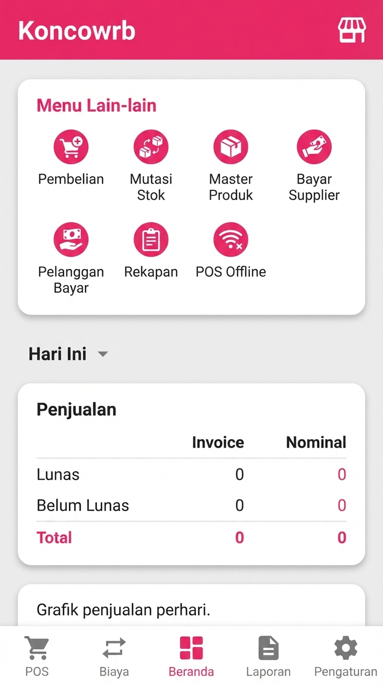
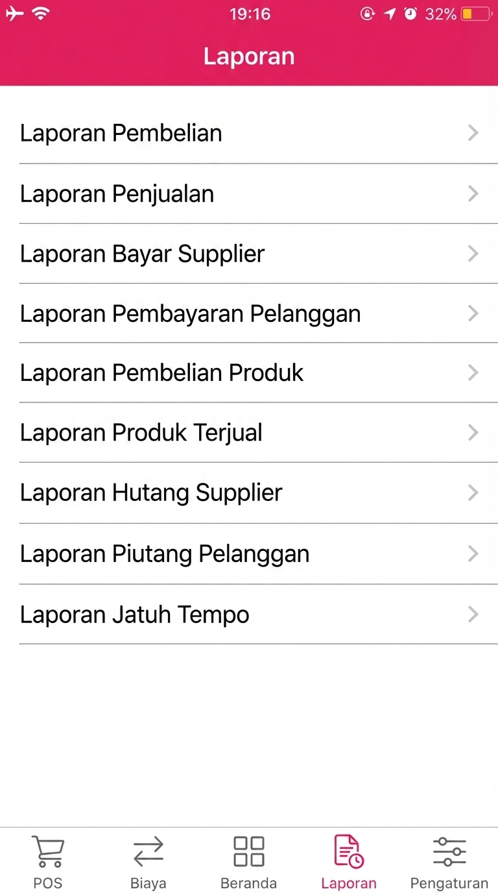
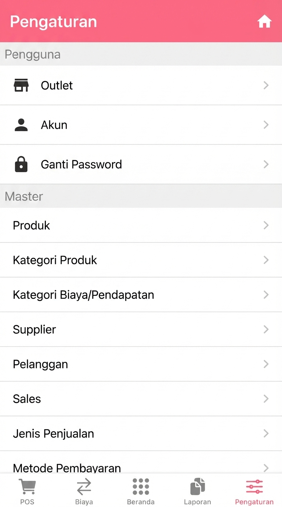

# KONCOPOS - Aplikasi Kasir Modern

Aplikasi Point of Sale (POS) berbasis web yang modern, cepat, dan mudah digunakan. Dibangun dengan vanilla JavaScript dan terintegrasi dengan Google Sheets sebagai database.

## 🚀 Fitur Utama

### 📱 Point of Sale
- Interface kasir yang intuitif dan responsif
- Keranjang belanja dengan edit qty real-time
- Multiple metode pembayaran (Tunai, Transfer, QRIS, Piutang)
- Cetak struk otomatis
- Support barcode scanner

### 📊 Laporan Lengkap
- **Penjualan**: Laporan penjualan, produk terjual, piutang
- **Pembelian**: Laporan pembelian, hutang supplier
- **Keuangan**: Laba rugi, arus kas, biaya & pendapatan
- **Stok**: Persediaan, mutasi stok
- **Sales**: Omset sales, invoice pelanggan/supplier
- **Jatuh Tempo**: Monitor piutang & hutang

### 📥 Export Data
- Export ke Excel (CSV)
- Export ke PDF dengan layout profesional
- Filter tanggal & search

### 👥 Manajemen
- Multi-user dengan role & permissions
- Manajemen produk, kategori, varian
- Manajemen pelanggan, supplier, sales
- Pengaturan outlet & printer

### 🔄 Sinkronisasi
- Auto-sync ke Google Sheets
- Push/Pull data manual
- Offline-first dengan LocalStorage
- Background sync otomatis

## 🛠️ Teknologi

- **Frontend**: Vanilla JavaScript, HTML5, CSS3
- **Backend**: Google Apps Script
- **Database**: Google Sheets
- **Storage**: LocalStorage (offline-first)
- **PDF**: jsPDF + AutoTable
- **Charts**: Chart.js
- **Icons**: Font Awesome 6

## 📦 Instalasi

### 1. Clone Repository
```bash
git clone https://github.com/yourusername/koncowrb-pos.git
cd koncowrb-pos
```

### 2. Setup Google Apps Script
1. Buka [Google Apps Script](https://script.google.com)
2. Buat project baru
3. Copy isi file `stitch/gas/Code.gs` ke Apps Script
4. Deploy sebagai Web App:
   - Execute as: **Me**
   - Who has access: **Anyone**
5. Copy URL deployment

### 3. Update URL GAS
Edit file `stitch/js/sync.js`:
```javascript
const GAS_URL = 'YOUR_DEPLOYMENT_URL_HERE';
```

### 4. Deploy
Upload folder `stitch/` ke web hosting atau jalankan local server:
```bash
# Menggunakan Python
python -m http.server 8000

# Menggunakan Node.js
npx http-server stitch -p 8000
```

Buka browser: `http://localhost:8000`

## 📱 PWA (Progressive Web App)

Aplikasi ini support PWA, bisa di-install di smartphone:
1. Buka di browser mobile
2. Tap menu "Add to Home Screen"
3. Aplikasi akan muncul seperti native app

## 🎨 Screenshot

### Dashboard


### Laporan


### Pengaturan


## 📖 Dokumentasi

### Struktur Folder
```
stitch/
├── gas/              # Google Apps Script
│   └── Code.gs
├── icons/            # PWA icons
├── js/               # JavaScript modules
│   ├── core.js       # Core functions
│   ├── auth.js       # Authentication
│   ├── pos.js        # POS system
│   ├── laporan.js    # Reports
│   ├── sync.js       # Sync engine
│   └── pdf-export.js # PDF generation
├── pages/            # HTML pages
├── index.html        # Main entry
├── style.css         # Styles
├── manifest.json     # PWA manifest
└── sw.js            # Service Worker
```

### Database Schema (Google Sheets)

**Sheets:**
- Users, Sessions (Auth)
- Produk, Kategori Produk
- Pelanggan, Supplier, Sales, Kasir, Kurir
- Transaksi, Transaksi Items
- Pembelian, Mutasi Stok, Biaya
- Laporan (Penjualan, Pembelian, Stok, dll)
- Outlet, Settings, Sync Log

## 🔐 Keamanan

- Session-based authentication
- Token expiry (30 hari)
- Password hashing (untuk production)
- User-level data isolation
- HTTPS required untuk production

## 🚧 Roadmap

- [ ] Multi-outlet support
- [ ] Inventory forecasting
- [ ] WhatsApp integration
- [ ] Payment gateway integration
- [ ] Advanced analytics & charts
- [ ] Mobile app (React Native)

## 🤝 Kontribusi

Kontribusi sangat diterima! Silakan:
1. Fork repository
2. Buat branch fitur (`git checkout -b feature/AmazingFeature`)
3. Commit perubahan (`git commit -m 'Add some AmazingFeature'`)
4. Push ke branch (`git push origin feature/AmazingFeature`)
5. Buat Pull Request

## 📄 Lisensi

MIT License - bebas digunakan untuk personal maupun komersial.

## 👨‍💻 Author

**KONCOPOS Team**
- Support: Sesuaikan kontak support sesuai deployment Anda
- Brand: KONCOPOS

## 🙏 Acknowledgments

- Font Awesome untuk icons
- jsPDF untuk PDF generation
- Chart.js untuk charts
- Google Apps Script untuk backend

---

⭐ Jika project ini membantu, berikan star di GitHub!

# koncoposnew

# koncoposweb
